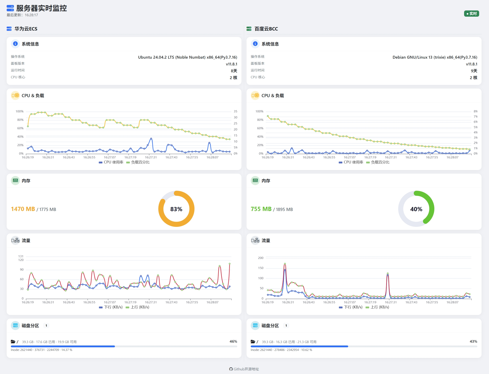
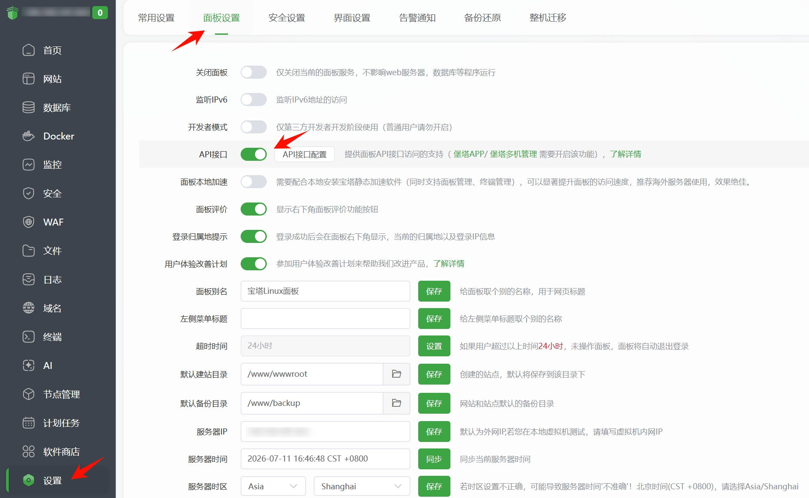
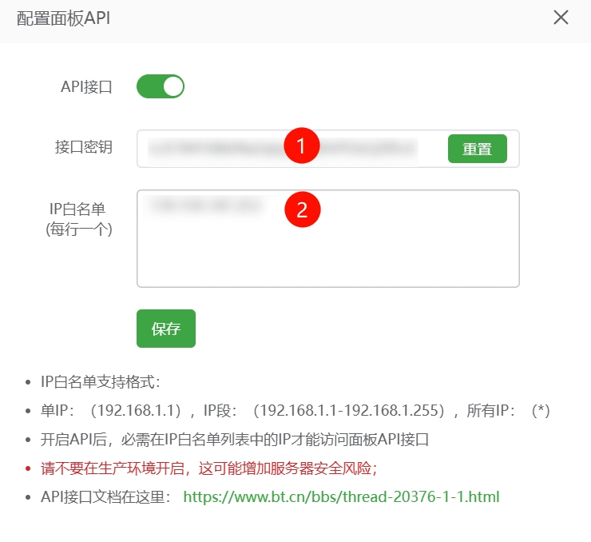

# bt-panel-status
PHP调用宝塔API实现服务器自动化监控

 

特点
*   系统信息：操作系统/面板版本/运行时间/CPU 核心
*   CPU & 负载：分为两条折线显示（鼠标悬浮显示详情%）
*   内存：占用样式0-80%绿色，80-90%橙色，90-100%红色
*   流量：上下行随时间变化且单位KB/s和MB/s自动切换
*   磁盘分区：显示总容量和使用量，用进度条表示占用

## 一、获取API

宝塔面板后台-设置-面板设置-API接口开启
 

配置请求IP白名单后保存，复制接口密钥
 

## 二、配置接口

index.php下载到本地，修改panel和key参数
```php
$servers = [
    [
        'name'  => '服务器 A',
        'panel' => 'https://192.168.1.245:8888',
        'key'   => 'your_first_api_key_here'
    ],
    [
        'name'  => '服务器 B',
        'panel' => 'https://192.168.1.246:8888',
        'key'   => 'your_second_api_key_here'
    ]
];
```
理论上还可无限加服务器C、D...实现效果如上图，服务器信息并排

panel是宝塔面板的ip地址+端口

注意：如果面板是强制https访问的话，则此处地址一定用https协议

## 三、使用监控

访问index.php的网络地址，支持子目录，则会在所在文件夹生成N个cookie文件（N=配置服务器个数）
